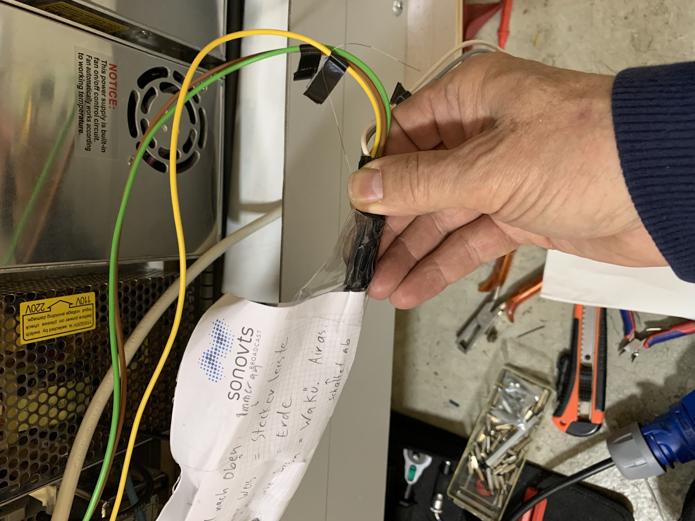

# Großer Laser Cutter (GLC)  
[Zum GLC Wiki - Anleitungen](https://github.com/makerspace-wi/Lasercutter-gross-150W/wiki/150W-Großer-Laser-Cutter-Wiki)  
Hierbei handelt es sich um ein DIY-Projekt, dass von Paul K. ins Leben gerufen wurde. Ziel war es einen Laser Cutter mit großer Bearbeitungsfläche (1500mm x 1500mm) und leistungsstarkem CO2-Laser (150W) aufzubauen. Beim Aufbau wurde 'nachhaltig' vorgegangen, so kamen vermehrt Materialien zu Einsatz, die gebraucht waren oder gar vom Schrottplatz kamen.

Der DIY-Lasercutter entstand 'planfrei' über mehrere Jahre und es hat eine große Anzahl von Mitgliedern des Makerspace-Wiesbaden den Aufbau unterstützt. 
Folgende Teams waren maßgeblich beteiligt:
- Design und Aufbau Mechanik
Laser Cutter Team - vorwiegend montags aktiv - Paul K., Stonie, Brani, Klaus F.
- Elektrischer Aufbau, Zugangs-Controller, Sicherheits Controller
Technik Team - vorwiegend dienstags aktiv - Michael M., Klaus F., Elian T. und Dieter H.
- Abluft bzw. Absaugung
wird in Absprache mit den anderen Teams von Brani koordiniert

Die Teams haben über die Monate und Jahre sehr viel gelernt. Oft war die Enttäuschung groß, doch es wurde nicht aufgegeben und alternative Lösungswege gefunden.

Jetzt - Oktober 2020 - hat der GLC einen mechanisch stabilen Zustand erreicht und eine Nutzung rückt in die Nähe.
Allerdings sind noch notwendige Arbeiten an Elektrik und Elektronik auszuführen, um alle Sicherheitsaspekte zu erfüllen.

<h1>Control Lasercutter Tagebuch zum aktuellen Umbau</h1>
Leider wurde der Aufbau vom GLC nicht dokumentiert, aus diesem Grund fehlt hier der Verlauf des Aufbaus über die letzten Jahre.
Das Technik Team jedoch hat seine Aktivitäten zu Verdrahtung, Zugangs-Controller, Sicherheits-Controller und Software Source Code gut dokumentiert und hier auf Github veröffentlicht. 
Dort findet ihr:

- [Bisherige Schaltbilder](doc/Schaltpläne_gr_LasercutterV5.pdf), d.h. letztendlich der momentane Zustand
- [Technik-Team Änderungsvorschlag - aktuell](doc/Schaltpläne_gr_LasercutterV6.pdf), dies sind die Änderungen, die wir zeitnah implementieren werden
- [RFID4Lasercutter](https://github.com/makerspace-wi/RFID4Lasercutter.git) - hier findet ihr den Sourcecode für den Zugangs-Controller
- [Zum GLC Wiki - Anleitungen](https://github.com/makerspace-wi/Lasercutter-gross-150W/wiki/150W-Großer-Laser-Cutter-Wiki)
<h2>Notwendige Arbeiten am großen Laser Cutter</h2>
19.10.2020 
Am Dienstag den 13.10.2020 hat sich das Technik-Team die Angelegenheit angeschaut und festgestellt, dass noch einige sicherheitsrelevante Änderungen durchgeführt werden müssen.

Der Technik-Vorstand hat festgelegt, dass keine Mitglieder für den GLC freigegeben werden dürfen, bis die im folgenden beschriebenen Änderungen ausgeführt sind.

		
<b>ACHTUNG - MOMENTAN sind die Sicherheitsschalter an den beiden Klappen NICHT verdrahtet!
Die NOT-AUS Schalter sollen/dürfen nicht zum Aus-/Einschalten des GLC genutzt werden!
Der Absauglüfter muss manuell vor dem LASERN nach Vorgabe eingeschaltet werden.
</b>

<h2>Vorschlag Technik Team zum Umbau des GLC</h2>

- Die 3 NOT-AUS Schalter - wenn ausgelöst - öffnen ein separates mechanisches Relais, dass die Ausgangsspannung der beiden Motornetzteilen unterbricht, die für die Achsensteuerung zuständig sind.

Desweiteren wird 'NOT-AUS' an den Controller gemeldet, der den Laser-Controller deaktiviert.
- der Stecker des GLC bleibt zukünftig immer in der Steckdose! Ein kleines Netzteil
versorgt ständig die GLC Zugangs- & Sicherheits Controller, die nur nach erfolgreichem ‘einloggen’ die Netzspannungen an alle Leistungsnetzteile anlegt und nur dann den CO2-Laser (Controller) aktiviert, wenn

		- die Sicherheitsschalter geschlossen sind
		- kein Not-Aus-Schalter aktiviert ist
		- die Rücklauftemperatur des Kühlwassers kleiner der Maximaltemperatur ist
		- die Flussgeschwindigkeit des Kühlwassers größer dem Grenzwert ist
		- und ein registriertes Mitglied eingeloggt ist

- Nach getaner Arbeit loggen sich die Mitglieder - wie bei den anderen Maschinen - wieder aus und alle Leistungsnetzteile werden vom Netz getrennt.

- Um die Absaugung zukünftig automatisiert einzuschalten, müssen diese vorher entsprechend umgebaut werden.

<h2>Thema Absaugung</h2>
Der momentane Absauglüfter hat einen Wechselstrommotor, dessen Drehzahl sich nicht einfach regeln läßt.
Dieser Absauglüfter ist extrem laut und hat schon zu Beschweden von Nachbarn geführt.
Momentane Behelfslösung vom Laser Cutter Team ist, den Lüfter ‘normal’ zu starten und dann mittels Phasenanschnittsteuerung die Versorgung so weit zu reduzieren, dass sich durch Eigenreibung die Drehzahl verringert.
Leider lässt sich dieser Prozess nicht automatisieren.

Das Technikteam hat dazu 2 Möglichkeiten evaluiert:

- einen elektronisch regelbaren	Wechselrichter besorgen und damit den Wechselstrommotor regeln - oder	
- bevorzugte Variante sind Lüfter mit Gleichstrommotoren (von Automobilradiatoren) einzusetzen, die mittels PWM auch elektronisch geregelt werden können. Diese Regelung ist bereits für den Kühlwasserlüfter erprobt.

Bei einer Diskussion mit Brani wurden wir uns einig, dass mehrere Lüfter im Absaugrohr installiert werden sollen. Wie schon oben erwähnt, will Brani diese Arbeiten koordinieren.

<h3>Dienstag der 03.11.2020</h3>

Zugangssteuerung und Controller wurde ausgebaut.

Plan ist es diese innerhalb von 2 Wochen umzubauen und einem Labor Debug zu unterziehen.
Es gibt einen neuen [Schaltplan (neu)](doc/Schaltpläne_gr_LasercutterV6.pdf), da der Maschinenschalter erhalten bleiben soll.

<h3>Dienstag der 10.11.2020</h3>

Leider wurde der GLC noch nicht gereinigt. Auch fanden wir gestern eine nachträglich eingebrachte Versorgungsleitung bestehend aus einem Niedrigspannungssignalkabel, um den großen Luftkompressor und den aktiven Kühler zu versorgen. Ein absolutes ‘No Go’ und muß nachgebessert werden.

Im Spannungsversorgungsprimärbereich fanden wir einige fragwürdige Verkabelungen, die erst mal entfernt wurden.
Das Technikteam wird in den kommenden Wochen den erforderlichen Sicherheitsstandard herstellen.
Vielen Dank an Klaus F. und bei Michael H. für die tatkräftige Hilfe.
Entfernt wurde der komplette Spannungsversorgungsprimärbereich, der Maschinenschalter wurde separiert und vom Not-Aus Kreis getrennt.

Ein neues Solid State Relais (SSR) wurde montiert, dieses wird in Zukunft die Haupversorgungsspannung durch den ‘Safety-Controller’ anlegen und trennen.

Von der 230V CEE Steckdose wurde ein Kabel in den ‘Maschinenraum’ geführt.
Von dort ein Kabel (L-Leiter über das SSR) zum Maschinenschalter geführt, der bei manueller Auslösung oder Stromausfall sowohl L- als auch N-Leiter trennt.
Damit wurde der Maschinenschalter erhalten und wird in Zukunft - nach dem einloggen - den GLC einschalten.
Im Notfall (und nur dann) kann über den Maschinenschalter ein NOT-AUS gemacht werden.
Die restlichen drei NOT-AUS Schalter, wie auch die Deckelschalter werden in Zukunft durch den ‘Safety Controller’ abgefragt.

Arbeiten für die kommenden Dienstage sind: 
die 3 NOT-AUS Schalter prüfen/verdrahten und Kabel zum Controller verlegen. Deckelschalter prüfen und Kabel zum Controller verlegen (diese unterbrechen den Laser-Controller wenn einer der Deckel geöffnet wird). Neue Temperatursensoren kontaktieren und montieren. Kleinnetzteil für den Safety-Controller montieren und Anschlüsse vorbereiten.
Ein Spannungsversorgungstrennrelais für die X- und Y-Achse muss auch noch installiert werden, dies wird maßgeblich durch die NOT-AUS Schalter aktiviert.
Auch das Kabel für  den Luftkompressor und den Kühler muss ausgetauscht werden.
Dann muss der modifizierte Safety-Controller und auch der RFID-Controller wieder installiert und angeschlossen werden.
Danach wird dann das System-Debug gestartet.

Gute Neuigkeiten: Der Michael M. hat die Platinenumbauten weitestgehend abgeschlossen und die neue Testsoftware läuft bereits im Labor.

An dieser Stelle nochmals unsere Bitte an das Laser Team die Maschine mal gründlich zu reinigen.
<h3>Dienstag der 17.11.2020</h3>
Dank an Michael H. für die großartige Unterstützung
<h4>Sicherheitsmaßnahmen ausgeführt:</h4>

- 230V AC Kabel für großen Luftkompressor und den aktiven Kühler gegen ein legitimes Netzkabel ausgetauscht
- 'fliegende' Verteilerdose an Wand montiert

Desweiteren haben wir
- die Aufnahmevorrichtung für das Kleinnetzteil montiert
- das Netzkabel für das Kleinnetzteil kontaktiert
- Ansteuerkabel für das Haupt-SSR kontaktiert
- NOT-AUS Relais für X- und Y-Spannungsversorgung in den Versorgungsstrang eingebracht und Ansteuerkabel kontaktiert. Das Relais-Gehäuse muss noch auf der Holzplatte befestigt werden.

Bleibt nur noch 
- das Kabel der Deckelschalter zum Anschluss vorbereiten
- die verbleibenden 3 NOT-AUS Schalter wieder zu verbinden und das Kabel an den Safety-Controller zu führen
- das Relais-Gehäuse auf der Holzplatte zu fixieren und in den Deckel ein kleines Loch zu bohren, damit man die verbaute LED sehen kann

Danach können die modifizierten Safety-Controller und Zugangs-Controller wieder eingebaut und mit dem System Debug begonnen werden.

<h3>Samstag, der 21.11.2020</h3>
<h4>Weitere Verbesserung bezüglich der One Wire Temperatursensoren für Kühlmittel Vor- und Rücklauf.</h4> 
Die bisherigen Sensoren waren selbst verlötet und 'irgendwie' an der Kühlmittelleitung angebracht. Diese Lösung funktionierte am Anfang gut, hat aber die Umbauarbeiten der <i><b>Lazerboys</b></i> leider nicht überlebt - es musste also eine robustere Lösung her. Passend dazu hatte neulich 

[az-delivery.de](https://az-delivery.de/products/2er-set-ds18b20-mit-3m-kabel?_pos=7&_sid=63a3cb1ca&_ss=r)

genau diese Sensoren in einer Edelstahlhülse im Angebot.
Passend dazu haben wird kurze Edelstahl-Schraubhülsen mit 1/2 Zoll Aussengewinde gefunden, die in ein PVC-T-Stück (noch nicht eingetroffen) geschraubt wird, das dann in den Kühlmittelfluss, vor und nach der Laserröhre eingebracht wird. In diese Hülsen können dann direkt die Sensoren geschützt montiert werden.

<h3>Dienstag, der 24.11.2020</h3>
Diesmal wieder dabei Michael H. - vielen Dank für die Unterstützung!

Wir kamen richtig gut voran:
- Not_AUS Schalter wurden neu verdrahtet
- Deckelschalter wurden korrekt kontaktiert und das Kabel zum Anschluss vorbereitet
- das Versorgungskabel für den 12V DC Lüftermotor wurde neu verlegt
- das Relais-Gehäuse wurde auf der Holzplatte fixiert und der Deckel bekam ein kleines Loch um die verbaute LED zu sehen
- das neue Mini-Netzteil wurde eingebaut
- die modifizierte Controller Plantine wurde wieder eingebaut
- die RFID-Leseeinheit mit Display wurde wieder eingebaut
- sämtliche Kabel von und zu dem Safety Controller wurden angeschlossen (mit Ausnahme der 230V AC Netzspannung)

Die bestellten PVC-T-Stücke waren leider noch nicht eingetroffen. D.h. nächsten Dienstag muss ein Teil des Kühlmittels abgelassen, die vorher präparierten T-Stücke eingesetzt und das Kühlmittel wieder aufgefüllt werden. 
Dann können die neuen Temperatursensoren angeschlossen und in die Tauchhülsen eingebaut werden.

Nach einer letzten optischen Überprüfung soll dann die erste Bestromung erfolgen und die Niederspannungs Signale/Funktionen getestet werden.
Falls dieser Test positiv ausfällt, werden wir die Netzspannung kontaktieren und mit der Endabnahme beginnen.

Mit ein bisschen Glück können die Umbauarbeiten nächsten Dienstag abgeschlossen werden.

<b>Hinweis:</b> 
Wir mussten die Gondel in der X-Richtung bewegen und stellten dabei fest, dass bei bestimmten Stellungen ein mechanisches 'Schleifgeräusch' zu hören ist. Leider konnten wir die Quelle nicht ausfindig machen. Hier sollten die 'Lazerboyz' noch mal genauer hinschauen.

<h3>Dienstag, der 01.12.2020</h3>
Eigentlich wollten wir an diesem Tag unser Safety-Umbauten abschliessen, damit der GLC in Betrieb gehen kann. Leider hat das nicht geklappt aus Gründen, die ich im folgenden erklären werde.

Es waren noch verschiedene Kabel, die neuen Temperatursensoren und der Durchflussmengenmesser anzuschließen - dafür mussten wir die vordere Blechverkleidung abnehmen.
Die PVC-T-Stücke wollen wir erst zum Schluss des Umbaus in den Kühlkreislauf montieren.
Nach dem vorzüglichen Pizza-Schmaus wagten wir die erste Niederspannungsbestromung, die zu unserer Überraschung sofort funktionierte. Zu diesem Zeitpunkt konnte man sich bereits an der Maschine anmelden, Vorlauf- und Rücklauftemperatur wurde korrekt angezeigt und die Durchflussmenge war 0,00 l/min - auch der Laser-Controller war deaktiviert.

Dann haben wir mutig die 230V AC Versorgung des GLC temporär mit WAGO-Klemmen hergestellt.
Nach dem Einloggen den Maschinenhauptschalter betätigt, woraufhin alle Agregate anliefen und die Gondel sich in Richtung Home-Position bewegte und auch ein Durchfluss von über 7,00 l/min angezeigt wurde.

Nun zu den schlechten Nachrichten: Die Temperaturmessung des Vor- und Rücklaufs wird mit (2) One Wire Temperatursensoren der Firma Dallas gemacht. Diese Sensoren hängen zusammen an einem Push-/Pull-Datenbus. Der Prozessor fordert die Temperatur an, danach sendet der jeweilige Sensor die Daten über den One Wire Bus zurück.
Dieser Bus ist sehr störanfällig und reagiert empfindlich auf Ein- und Ausschaltspitzen, was dazu führt, dass manchmal die Datenwerte auf dem Bus gestört werden und der Prozessor meint er hätte einen Sensor verloren, bzw. ein Temperaturwert ist zu hoch (der ist dann 99,9).
Wenn dies passiert deaktiviert der Safety-Prozessor sowohl den Controller für die Steppermotoren, sowie das Laser Netzteil.
Unser Fokus nächsten Dienstag wird sein, die Temperaturmessung irgendwie stabil zu bekommen. 

Folgende Maßnahmen sind geplant:
- den Datenbus Pull-Up Widerstand von 4.7k auf 2k oder gar 1k zu reduzieren 
- für die Leitungen zu den Sensoren abgeschirmte Kabel verwenden
- am Ende der Leitung (Sensor) die Versorgungsspannung mit 0,1uF 'entstören'
- ggf. nur noch die Rücklauftemperatur zu messen
- oder Plan B - eine andere Meßmethode wählen

Es tut uns Leid, dass der finale Umbau nun doch wesentlich länger braucht, als ursprünglich geplant.
